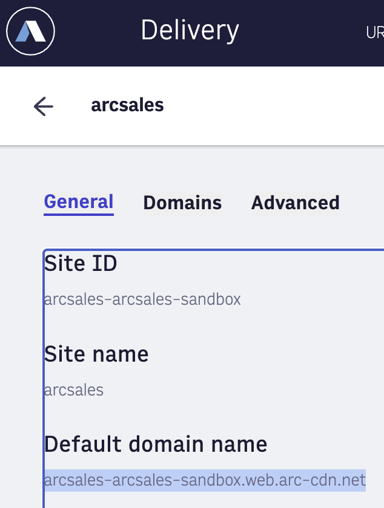

# Initialize the Android Mobile SDK


### Installing the SDK from binary

The SDK is distributed as an .aar and .pom file combination that is loaded locally by your app **OR** by downloading from Maven.

Check the latest release **version number** from releases/tags on this repo

#### Installing from local binaries

To include the SDK in you app create the following directory structure at the root level of your app:

`arcxp-libs/arcxp-sdk-android/arcxp-mobile-sdk-android/<version number>`

Place the following files in this directory:

`arcxp-mobile-sdk-android-<version number>.aar`
`arcxp-mobile-sdk-android-<version number>.pom`

In the `build.gradle` file of the app add the following code to the repositories {} section:

```groovy
maven {
    url "${project.rootDir}/arcxp-libs"
}
```

Add the following line to the dependencies{} section of the same file:

```groovy
groovy:
implementation 'arcxp-sdk-android:arcxp-mobile-sdk-android:<version-number>'
or
kotlin dsl:
implementation("arcxp-sdk-android:arcxp-mobile-sdk-android:<version-number>")
```

This implementation is shown in the demo app.

_**OR**_

_**If you are using Maven to download the SDK:**_

* The ArcXP Maven Repository is hosted on Github Packages.  To gain access to the repository do the following:
  * Request access to the Github Packages repository through the ArcXP Mobile Development Team.  You will need to provide your Github User ID.
  * Once you have been granted access and accepted the invitation create a Personal Access Token (PAT) for the repository.
  * Instructions for creating a PAT are here:
    * [https://docs.github.com/en/enterprise-server@3.4/authentication/keeping-your-account-and-data-secure/managing-your-personal-access-tokens](https://docs.github.com/en/enterprise-server@3.4/authentication/keeping-your-account-and-data-secure/managing-your-personal-access-tokens)
  * **Make sure you create a classic PAT and not a Fine Grained PAT**
  * **Once you have created a PAT make sure to be mindful of how to secure the token.**
    * [https://docs.github.com/en/authentication/keeping-your-account-and-data-secure/managing-your-personal-access-tokens#personal-access-tokens-classic](https://docs.github.com/en/authentication/keeping-your-account-and-data-secure/managing-your-personal-access-tokens#personal-access-tokens-classic)
    * When creating the PAT you will be asked to specify permissions.  Only the 'read packages'permission is needed for this requirement.
* **Make sure to save the PAT when it is given to you.  You will only be shown once and it will be the password to access the SDK.**
* Once you have created a PAT you can now access the SDK.
* In the dependencies section of your app add the following line:  

    ```groovy
   implementation ‘arcxp-sdk-android:arcxp-mobile-sdk-android:<version-number>’
    ```

* In the root level build.gradle file add the following code:

    ```groovy
     allprojects {
            repositories {
                maven {
                    credentials {
                        username "$GITHUB_USER_ID"
                        password "$PAT"
                    }
                    url 'https://maven.pkg.github.com/arcxp/arcxp-sdk-android'
                }
            }   
    } 
    ```

* `GITHUB_USER_ID` and `PAT` will be the Github user `ID` for the account that has access to the repository and the `PAT` is the `PAT` you just created.

On newer projects, this should instead be added to the repositories block in settings gradle, example with kotlin dsl:  

```groovy
    pluginManagement {
        repositories {
            google()
            mavenCentral()
            gradlePluginPortal()
        }
    }
    dependencyResolutionManagement {
        repositoriesMode.set(RepositoriesMode.FAIL_ON_PROJECT_REPOS)
        repositories {
            google()
            mavenCentral()
            maven {
                credentials {
                    username = "$GITHUB_USER_ID"
                    password = "$PAT"
                }
                url = uri("https://maven.pkg.github.com/arcxp/arcxp-sdk-android")
            }
        }
    }
    
    rootProject.name = "My Application"
    include(":app")
```

[Example Project with just the import](https://github.com/arcxp/arcxp-mobile-sdk-android-test/tree/main)

## Initializing the SDK

After installing the dependency in your application, inside your Application class in onCreate you can initialize the SDK via the singleton ArcXPMobileSDK via the initialize function:

```kotlin
    fun initialize(
        application: Application,
        org: String,
        site: String,
        environment: String,
        baseUrl: String,
        contentConfig: ArcXPContentConfig? = null,
        commerceConfig: ArcXPCommerceConfig? = null,
        clientCachedData: Map<String, String>? = null,
    ) 
```

The required fields are an application reference (\`this\` in application class (application context)), string descriptors of **site**, **org**, **environment**, **baseUrl**.

| | |
|-|-|
| The **baseUrl** can be determined from your cdn url settings. **Delivery** > **Choose Site** > **Default domain name** | |

Video - initialized by default (exposes video center api)

There are two optional modules: **Content** and **Commerce**.

Content will allow surfacing of content elements via outbound feeds, while Commerce offers login and paywall options.

### Content Initialization

### Prerequisites

The SDK accesses data using outbound feeds. The URL to access this is built using your company's assigned organization name, site name and the environment you are trying to access (sandbox or production). These values can be obtained from your ArcXP contact.

The outbound feeds setup can be tested by navigating to the following URL using a web browser:

_{base Url provided}/arc/outboundfeeds/navigation/default_

If this URL returns JSON then the outbound feeds is set up. If it returns an error then the outbound feeds are not set up or are set up incorrectly and the Content Module will not work.

If they are not set up, reach out to your Technical Account Manager.

If they are setup continue and follow both of these instructions closely:

[Backend Setup For Mobile SDK](back-end-setup-for-mobile-sdk.md)

[Resolver Setup For Mobile SDK](mobile-sdk-resolver-setup.md)

After following all steps there, you can continue on:

### Installing SDK from submodule/fork

Since we are open source now, you can just add the library repo directly as a submodule to your android project.  This way you can edit the library code and test without creating/releasing a binary.

### Initialization

The optional content portion of sdk is accessible after initialization, It must be initialized before use otherwise it will throw a runtime exception.

To use, the SDK must be initialized with an ArcXPContentConfig object. This object will contain the necessary information to allow the SDK to access the content data. It will also contain various values and flags indicating which functionality to turn on and the parameters associated with it. This includes caching and preloading.

The SDK need only be initialized a single time somewhere in the code that will execute before any SDK calls are made. Because the SDK is a singleton a pointer to the SDK is not returned from the initialization method

The ArcXPContentConfig object has the following fields:

| Field | Description |
|--|--|
| `orgName, siteName, environment` | The three parts of the base URL for the client account. The URL is of the format https://\[orgName\]-\[siteName\]-\[environment\].cdn.arcpublishing.com. These are set through the method setUrlComponents(). These values will be provided by Arc XP. |
| `maxCacheSize` | Maximum size the cache can occupy on the device. If it exceeds this size then the SDK will purge items to return it to this value. |
| `cacheTimeUntilUpdate` | After this threshold has been reached, new data is requested from the backend. |
| `setMaxCacheIdleTime` | The maximum amount of time an item in the cache can go without being accessed before being purged. |
| `setPreloading` | If this Boolean is true (defaults to true), the SDK will make network requests for ANS ids for each collection result to preload the database. |
| `baseUrl` | The full base URL of the content endpoint. This value is required. |
| `navigationEndpoint` | The endpoint suffix where the section list collection information can be accessed. |
| `videoCollectionName` | The collection alias of a collection containing videos, for use with video tab in sample app |

The following code will produce a configuration object used to initialize content portion of SDK:

```kotlin
val arcxpContentConfig = ArcxpContentConfig.Builder()
        //Set the base URL for content.  Set the organization, site and environment.
        //These values can be gotten from the ArcXP admin
    .setBaseUrl(url = “base outbound feeds url”
        //customize this for your organization
    .setOrgName(name = “orgname”)
        //customize this for your site name
    .setSite(site = “site”)
        //customize this for your environment name
    .setEnvironment(env = “environment”)
        //This is an additional parameter put on the base URL that retrieves the
        //section data for mobile devices.  Should match your site service ID you created for mobile
    .setNavigationEndpoint(endpoint = “mobile-nav”)
        //This is a string corresponding to a video collection content alias you created
    .setVideoCollectionName(videoCollectionName = “mobile-video”)
        //Content module caches ANS data to decrease the amount of bandwidth needed.
        //This value can be between 10 and 1024 MB
    .setCacheSize(sizeInMB = 1024)
        //After a specified number of minutes cached items will be updated to
        //ensure the latest version is available.
    .setCacheTimeUntilUpdate(minutes = 5)
        //if true will pre-fetch and store in db any stories returned by a collection call
    .setPreloading(preLoading = true)
    .build()
```

This object will be the optional content initialization parameter for the initialization function

[More information on Content Module](/docs/getting-started-with-the-content-module.md)

### Commerce Initialization

[Getting started with Commerce](/docs/getting-started-with-the-commerce-module.md)

The SDK is configured for commerce use using the `ArcCommerceConfig` object. This object contains the following fields:

|Field | Description |
|--|--|
| `rememberUser`| Setting this to true will cause the SDK to cache the UUID, access token and refresh token for the session. Default is false.|
| `orgName`, `siteName`, `environment` | The three parts of the base URL for the client account. The URL is of the format `https://[orgName]-[siteName]-[environment].api.cdn.arcpublishing.com`. These are set through the method `setUrlComponents()`. These values will be provided by Arc XP. |
| `baseUrl`| An alternative to setting the three components individually, the entire base URL can be set. This value will be provided by Arc XP.|
| `useLocalConfig` | Do not load the configuration settings from the server but use the settings set in this object. Default is false.|

If the `useLocalConfig` flag is set to true then it is necessary to set the following configuration items:

| Configuration Item | Description |
|--|--|
| `recaptchaSiteKey`| The site key provided by Recaptcha for the app.|
| `recaptchaForSignup` | Setting this to true will cause the reCAPTCHA process to be run automatically by the SDK when the user registration method is called. Default is false. |
| `recaptchaForSignin`| Setting this to true will cause the reCAPTCHA process to be run automatically by the SDK when the login method is called. The default value is false. |
| `recaptchaForOneTimeAccess`| Setting this to true will cause the reCAPTCHA process to be run automatically by the SDK when the `requestOneTimeAccessLink()` method is called. The default value is false. |
| `facebookAppId`| Facebook app ID for Facebook login.|
| `googleClientId`| Client ID from Google for Google Sign In. |
| `pwLowercase` | Integer to specify the number of lowercase characters required in passwords.|
| `pwMinLength`| Integer to specify the minimum length of passwords.|
| `pwPwNumbers`| Integer to specify the number of numbers required in passwords. |
| `pwSpecialCharacters`| Integer to specify the number of special characters required in passwords.|
| `pwUppercase` | Integer to specify the number of uppercase characters required in passwords.|
| `autoCache` | Setting this to true will allow the SDK to store encrypted user data (uuid, accessToken & refreshToken). Default value is false.|

The following code will produce a single instance of a configured `ArcCommerceManager`. Multiple instances of the manager can be created within a single app.

```kotlin
val clientCachedData = mutableMapOf<String, String>() // Needed for storing user data from system preferences if client wants to handle caching. 

val arcCommerceConfig = ArcxpCommerceConfig.Builder()
            .setContext(activity?.applicationContext!!)
            .setRecaptchaSiteKey(getString(R.string.site_key))
            .enableRecaptchaForOneTimeAccess(false)
            .enableRecaptchaForSignin(false)
            .enableRecaptchaForSignup(false)
            .setUrlComponents("org", "site", "env")
            .enableAutoCache(false)
            .build()
            
//Only needed if enableAutoCache is set to false
if(!arcCommerceConfig.autoCache){
    sharedPref?.getString("uuid", "")?.let { clientCachedData.put("uuid", it) }
    sharedPref?.getString("accessToken", "")?.let { clientCachedData.put("accessToken", it) }
    sharedPref?.getString("refreshToken", "")?.let { clientCachedData.put("refreshToken", it) }
} 
```

**These two objects can be used in the optional parameters to initialize commerce**

Initialize Sample Call using both optional commerce and content configurations

```kotlin
ArcXPMobileSDK.initialize(
    application = this,
    site = getString(R.string.siteName),
    org = getString(R.string.orgName),
    environment = getString(R.string.environment),
    commerceConfig = arcCommerceConfig, //omit this line if you are not using the Commerce Module
    contentConfig = arcxpContentConfig, //omit this line if you are not using the Content Module
    baseUrl = getString(R.string.contentUrl)
)
```

These are the string ids we use in sample apps, but any string works.

## Resizer Key

The SDK implements an image resizer to avoid downloading larger images than necessary on device and thus incurring unnecessary bandwidth costs.  There are 2 versions of the image resizer, V1 and V2. V1 will be deprecated in April of 2024 so references to this version will not apply after this date.

Versions of the SDK before 1.1.0 will require a V1 Resizer key. If you don’t have it, please contact your Technical Account Manager. Your key should not be shared or made public.

You can place it in `local.properties` file at root of project `resizer_key = XXXXX`

These versions of the SDK will throw an exception if the V1 resizer key is not included.

Versions of the SDK 1.1.0 and later have the V2 Resizer implemented. This does not require a key like V1 as the keys are embedded within the response JSON.  A V1 resizer key can still be included and the V1 resizer will be used if V2 keys are not included within the response JSON.  After the deprecation date for V1 it will no longer be used as a fallback for the V2 resizer.  If the V2 resizer is not able to resize and image and the V1 resizer is either not enabled (no key provided) or the deprecation date has passed, a full size image will be returned.

