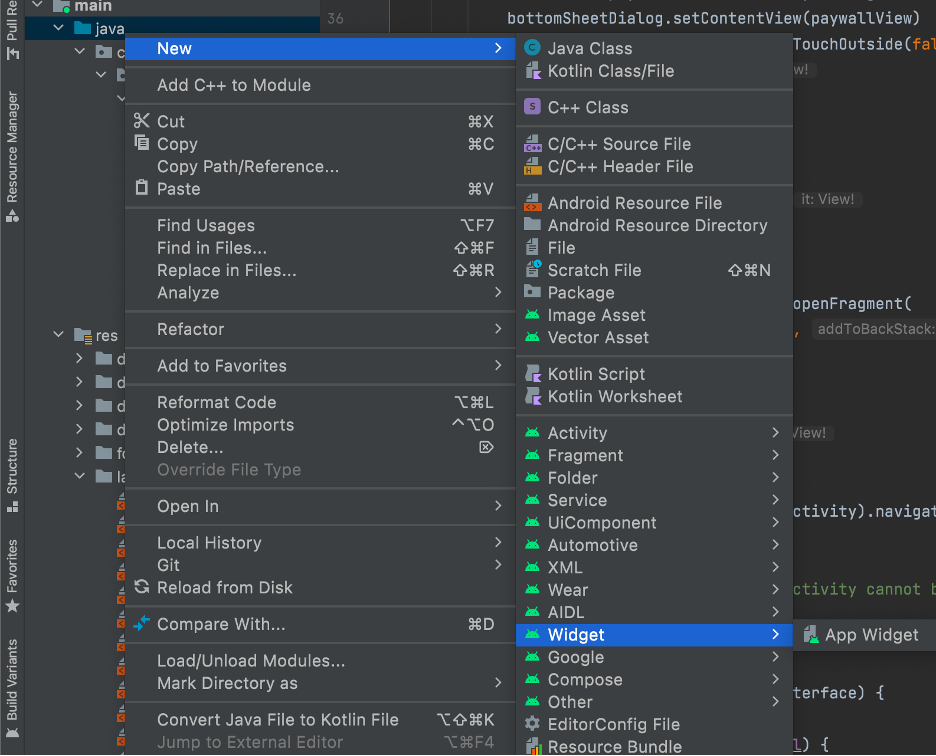
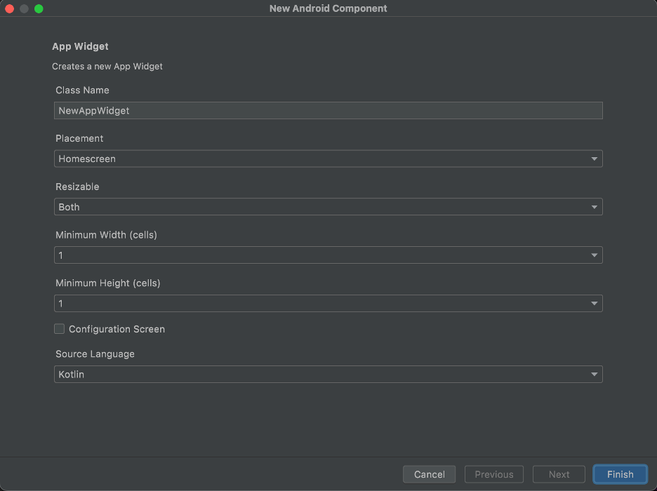
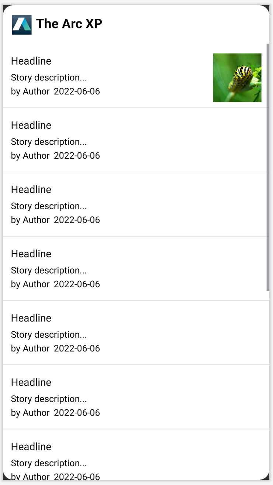
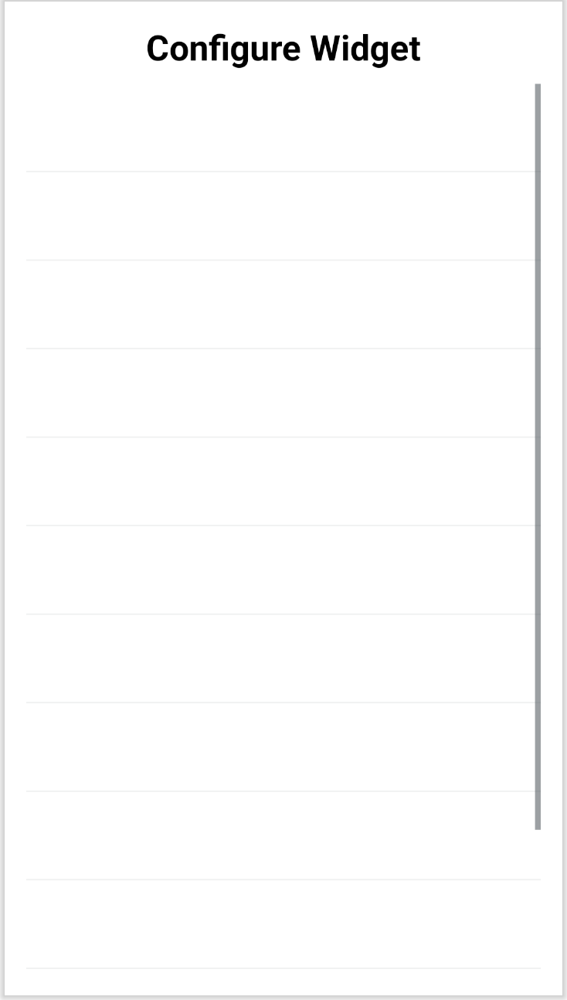
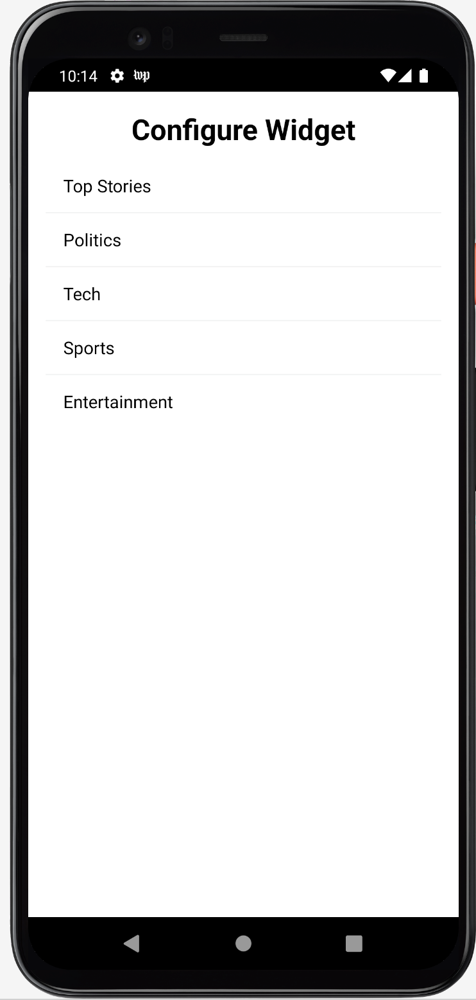
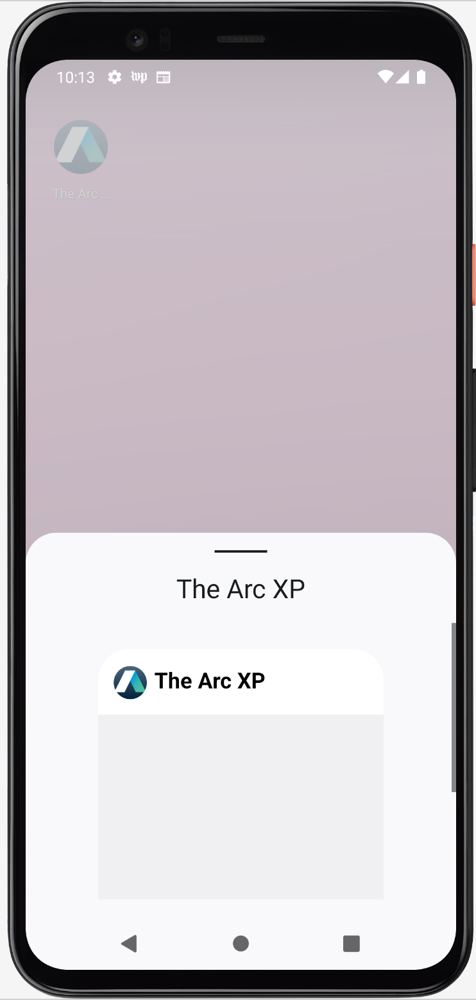
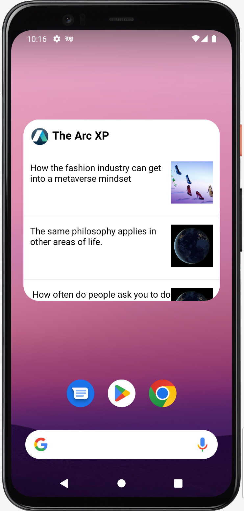
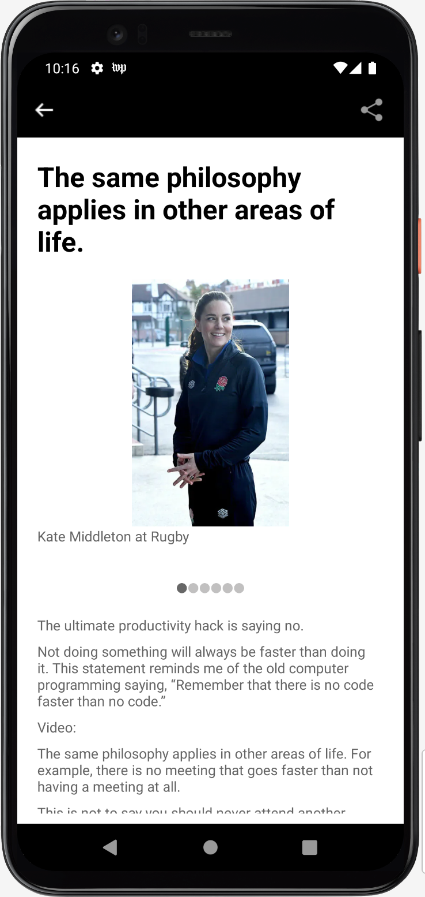

# What is a widget?

Widgets are smaller views of an application that can be placed on the home screen for faster access.

## Goal

To configure your app with a Widget that displays Stories and navigates to a detail view on interaction with the Widget.

## Prerequisites

**System Requirements**

* An android device
* A PC/Desktop/Mac running Android Studio

## How to create one?

In the Android Studio menu, select **File -> New -> Widget -> App Widget**.



This will open a configuration screen.



* On this screen, name your widget under the **Class Name** prompt.
* Widgets can be placed on the home screen or the lock screen. However, it can only be placed on the lock screen (called keyguard) for Android versions lower than 5.0.
* Make your widget resizable.
* Determine the size of your widget with the **Minimum Width** and **Minimum Height** prompts. For ArcXP widget, we have chosen 4x3 size.
* Check Configuration Screen if you want a configuration activity for your widget to change the appearance of the widget based on user input. To follow this tutorial, check Configuration Screen, since we are displaying .

When you select **Finish**, a sample widget gets created. Of those files, these five files need to be changed to make a custom widget: a Kotlin class for the widget, a Kotlin class for the configuration activity, a xml layout for the widget, a xml layout for the configuration activity, and a xml file for the widget details.

## Making the Widget Layout

Open the `arc_x_p_widget.xml`, which can be found under **app -> res -> layout** in the project menu.

Go to the text of the layout. Add the following TextView and ImageView as required and change some of the settings, as shown below:

```xml

<LinearLayout xmlns:android="http://schemas.android.com/apk/res/android"
    xmlns:tools="http://schemas.android.com/tools"
    style="@style/Widget.TheArcXP.AppWidget.Container"
    android:layout_width="wrap_content"
    android:layout_height="match_parent"
    android:layout_margin="@dimen/widget_margin"
    android:orientation="vertical"
    android:padding="0dp"
    android:theme="@style/Theme.MyApplication.AppWidgetContainer">

    <LinearLayout
        android:layout_width="match_parent"
        android:layout_height="wrap_content"
        android:padding="14dp"
        android:background="@color/white">

        <ImageView
            android:id="@+id/arcxpWidgetImg"
            android:layout_width="30dp"
            android:layout_height="30dp"
            android:src="@mipmap/ic_launcher"
            android:layout_marginTop="1sp"/>

        <TextView
            android:layout_width="wrap_content"
            android:layout_height="wrap_content"
            android:text="@string/app_name"
            android:textColor="@color/black"
            android:textSize="20sp"
            android:textStyle="bold"
            android:layout_marginStart="7sp"/>
    </LinearLayout>

    <LinearLayout
        android:id="@+id/widgetLL"
        android:layout_width="match_parent"
        android:layout_height="match_parent"
        android:orientation="vertical">

        <ListView
            android:id="@+id/widgetListView"
            android:layout_width="match_parent"
            android:layout_height="match_parent"
            tools:listitem = "@layout/widgetrow"/>
    </LinearLayout>

</LinearLayout>
```

Add another layout in the **app -> res -> layout** in the project menu: `widgetrow.xml`. Add the following code in the file.

```xml

<?xml version="1.0" encoding="utf-8"?>
<LinearLayout xmlns:android="http://schemas.android.com/apk/res/android"
    xmlns:tools="http://schemas.android.com/tools"
    android:id="@+id/widget_item"
    android:layout_width="match_parent"
    android:layout_height="match_parent"
    android:background="@android:color/white"
    android:orientation="vertical"
    android:padding="0dp">

    <LinearLayout
        android:layout_width="match_parent"
        android:layout_height="wrap_content"
        android:layout_marginLeft="0dp"
        android:layout_marginTop="7dp"
        android:layout_marginRight="0dp"
        android:orientation="horizontal"
        android:paddingTop="8dp"
        android:paddingBottom="8dp"
        android:paddingLeft="12dp"
        android:paddingRight="12dp">


        <LinearLayout
            android:layout_width="0dp"
            android:layout_height="wrap_content"
            android:layout_weight="1"
            android:orientation="vertical">

            <TextView
                android:id="@+id/tvHeadline"
                android:layout_width="wrap_content"
                android:layout_height="wrap_content"
                android:textColor="@color/black"
                android:textSize="16sp"
                tools:text="Headline" />

            <TextView
                android:id="@+id/tvStoryDesc"
                android:layout_width="wrap_content"
                android:layout_height="wrap_content"
                android:layout_marginTop="5dp"
                android:textColor="@color/black"
                tools:text="Story description..." />

            <LinearLayout
                android:layout_width="match_parent"
                android:layout_height="match_parent"
                android:orientation="horizontal">

                <TextView
                    android:id="@+id/tvAuthor"
                    android:layout_width="wrap_content"
                    android:layout_height="wrap_content"
                    android:textColor="@color/black"
                    android:textSize="14sp"
                    tools:text="by Author" />

                <TextView
                    android:id="@+id/tvPostTime"
                    android:layout_width="match_parent"
                    android:layout_height="wrap_content"
                    android:layout_marginStart="4dp"
                    android:padding="2dp"
                    android:textColor="@color/black"
                    tools:text="2022-06-06" />

            </LinearLayout>

        </LinearLayout>
        
        <ImageView
            android:id="@+id/imgArticle"
            android:layout_width="75dp"
            android:layout_height="75dp"
            android:scaleType="centerCrop"
            android:visibility="visible"
            tools:srcCompat="@tools:sample/backgrounds/scenic" />
    </LinearLayout>
</LinearLayout>
```


The widget layout after adding the above code looks like this:



## Making configuration activity

Add a ListView in FrameView layout that can have data dynamically.

```xml

<?xml version="1.0" encoding="utf-8"?>
<FrameLayout xmlns:android="http://schemas.android.com/apk/res/android"
    xmlns:tools="http://schemas.android.com/tools"
    style="@style/Widget.TheArcXP.AppWidget.Container"
    android:layout_width="match_parent"
    android:layout_height="match_parent"
    android:layout_margin="@dimen/widget_margin"
    android:theme="@style/Theme.MyApplication.AppWidgetContainer"
    android:background="@color/white">

    <LinearLayout
        android:layout_width="match_parent"
        android:layout_height="match_parent"
        android:orientation="vertical"
        android:layout_margin="0dp">

        <TextView
            android:id="@+id/config_top_stories"
            android:layout_width="match_parent"
            android:layout_height="wrap_content"
            android:layout_marginBottom="10dp"
            android:textColor="@color/black"
            android:text="@string/configure"
            android:textSize="26sp"
            android:textStyle="bold"
            android:gravity="center_horizontal"/>

        <ListView
            android:id="@+id/widgetConfigListView"
            android:layout_width="match_parent"
            android:layout_height="wrap_content" />

    </LinearLayout>
</FrameLayout>
```

 

Adding the following code in `ArcXPWidgetConfigureActivity.kt` (Kotlin file for configuration) to populate the values in the listview:

```kotlin

    class ArcXPWidgetConfigureActivity : Activity() {
    private var appWidgetId = AppWidgetManager.INVALID_APPWIDGET_ID
    private lateinit var configListView: ListView
    private lateinit var binding: ArcXPWidgetConfigureBinding
    private val configSectionListItems = mutableListOf<String>()
    private val configListIds = mutableListOf<String>()

    public override fun onCreate(icicle: Bundle?) {
        super.onCreate(icicle)

        // Set the result to CANCELED.  This will cause the widget host to cancel
        // out of the widget placement if the user presses the back button.
        setResult(RESULT_CANCELED)

        binding = ArcXPWidgetConfigureBinding.inflate(layoutInflater)
        setContentView(binding.root)

        val coroutineContext = CoroutineScope(Dispatchers.IO + SupervisorJob())
        coroutineContext.launch {
            val result: Either<ArcXPContentError, List<ArcXPSection>> =                            ArcXPMobileSDK.contentManager().getSectionListSuspend(false)
            if (result is Success) {
                result.success.forEach { entry ->
                    configSectionListItems.add(entry.navigation.nav_title.toString())
                    configListIds.add(entry.id)
                }
            } else {
                Log.d(TAG, "Failure")
            }
        }

        configListView = findViewById(R.id.widgetConfigListView)
        binding.widgetConfigListView.isClickable = true

        val widgetConfigAdapter: ArrayAdapter<String> = object : ArrayAdapter<String>(
            this, android.R.layout.simple_list_item_1, configSectionListItems as List<String>) {
            override fun getView(position: Int, convertView: View?, parent: ViewGroup): View {
                val view = super.getView(position, convertView, parent)
                val text = view.findViewById<View>(android.R.id.text1) as TextView
                text.setTextColor(Color.BLACK)
                return view
            }
        }
        binding.widgetConfigListView.adapter = widgetConfigAdapter
        binding.widgetConfigListView.setOnItemClickListener { parent, view, position, id ->
            val context = this@ArcXPWidgetConfigureActivity

            val widgetText = configListIds[position].substring(1)
            saveTitlePref(context, appWidgetId, widgetText)

            val appWidgetManager = AppWidgetManager.getInstance(context)
            updateAppWidget(context, appWidgetManager, appWidgetId)

            val resultValue = Intent()
            resultValue.putExtra(AppWidgetManager.EXTRA_APPWIDGET_ID, appWidgetId)
            setResult(RESULT_OK, resultValue)
            finish()
        }

        // Find the widget id from the intent.
        val intent = intent
        val extras = intent.extras
        if (extras != null) {
            appWidgetId = extras.getInt(
                AppWidgetManager.EXTRA_APPWIDGET_ID, AppWidgetManager.INVALID_APPWIDGET_ID
            )
        }

        // If this activity was started with an intent without an app widget ID, finish with an error.
        if (appWidgetId == AppWidgetManager.INVALID_APPWIDGET_ID) {
            finish()
            return
        }
    }
}

private const val PREFS_NAME = "com.arcxp.thearcxp.ArcXPWidget"
private const val PREF_PREFIX_KEY = "appwidget_"

// Write the prefix to the SharedPreferences object for this widget
internal fun saveTitlePref(context: Context, appWidgetId: Int, text: String) {
    val prefs = context.getSharedPreferences(PREFS_NAME, 0).edit()
    prefs.putString(PREF_PREFIX_KEY + appWidgetId, text)
    prefs.apply()
}

// Read the prefix from the SharedPreferences object for this widget.
// If there is no preference saved, get the default from a resource
internal fun loadTitlePref(context: Context, appWidgetId: Int): String {
    val prefs = context.getSharedPreferences(PREFS_NAME, 0)
    val titleValue = prefs.getString(PREF_PREFIX_KEY + appWidgetId, null)
    return titleValue ?: context.getString(R.string.appwidget_text)
}

internal fun deleteTitlePref(context: Context, appWidgetId: Int) {
    val prefs = context.getSharedPreferences(PREFS_NAME, 0).edit()
    prefs.remove(PREF_PREFIX_KEY + appWidgetId)
    prefs.apply()
}
```

The configuration activity looks as below image:



Create a Service file `ArcXPWidgetService.kt` for the widget with the following code

```kotlin

    class ArcXPWidgetService : RemoteViewsService() {
    override fun onGetViewFactory(intent: Intent): RemoteViewsFactory {
        return WidgetItemFactory(this.applicationContext, intent)
    }
}
```

Create an inner factory class `WidgetItemFactory` in this Service class with the following code. The Service class should look like this after adding the code.

Alternatively, you can also right click in the class and select **Generate... -> override methods...** to generate the methods and add the code based on the requirement.

```kotlin

    class ArcXPWidgetService : RemoteViewsService() {
    override fun onGetViewFactory(intent: Intent): RemoteViewsFactory {
        return WidgetItemFactory(this.applicationContext, intent)
    }

    class WidgetItemFactory(
        val context: Context,
        val intent: Intent
    ) : RemoteViewsFactory {

        private val headlinesBasics = mutableListOf<String>()
        private var imgUrl = mutableListOf<String>()
        private val widgetArticleId = mutableListOf<String>()
        private var sectionId = ""

        override fun onCreate() {
            getWidgetContent()
        }

        override fun onDataSetChanged() {
        }

        override fun onDestroy() {
        }

        private fun getWidgetContent(){
            val appWidgetId = intent.extras?.getInt(
                AppWidgetManager.EXTRA_APPWIDGET_ID,
                AppWidgetManager.INVALID_APPWIDGET_ID
            ) ?: AppWidgetManager.INVALID_APPWIDGET_ID

            sectionId = loadTitlePref(context, appWidgetId)

            val coroutineContext = CoroutineScope(Dispatchers.IO + SupervisorJob())
            coroutineContext.launch {
                val result: Either<ArcXPContentError, Map<Int, ArcXPCollection>> = ArcXPMobileSDK.contentManager().getCollectionSuspend(sectionId)
                if (result is Success) {
                    result.success.forEach { entry ->
                        entry.value.headlines.basic?.let { headlinesBasics.add(it) }
                        entry.value.id.let { widgetArticleId.add(it) }

                        if (entry.value.imageUrl().isNotEmpty()) {
                            imgUrl.add(entry.value.imageUrl())
                        }
                    }
                    AppWidgetManager.getInstance(context).notifyAppWidgetViewDataChanged(appWidgetId, R.id.widgetListView)
                } else {
                    Log.d(TAG, "WidgetItemFactory Failure")
                }
            }
        }

        override fun getCount(): Int {
            return headlinesBasics.size
        }

        override fun getViewAt(position: Int): RemoteViews {
            val views = RemoteViews(context.packageName, R.layout.widgetrow)
            if(position < headlinesBasics.size && headlinesBasics[position].isNotEmpty()) {
                views.setTextViewText(R.id.tvHeadline, headlinesBasics[position])
            }

            if(position < imgUrl.size && imgUrl[position].isNotEmpty()) {
                var image: Bitmap? = null
                try {
                    val `in` = java.net.URL(imgUrl[position]).openStream()
                    image = BitmapFactory.decodeStream(`in`)
                } catch (e: Exception) {
                    e.printStackTrace()
                }
                views.setImageViewBitmap(R.id.imgArticle, image)
            }

            val appWidgetId = intent.extras?.getInt(
                AppWidgetManager.EXTRA_APPWIDGET_ID,
                AppWidgetManager.INVALID_APPWIDGET_ID
            ) ?: AppWidgetManager.INVALID_APPWIDGET_ID

            val fillInIntent = Intent(context, ArcXPWidget::class.java).apply {
                putExtra(AppWidgetManager.EXTRA_APPWIDGET_ID, appWidgetId)
                data = Uri.parse(toUri(Intent.URI_INTENT_SCHEME))
            }

            fillInIntent.putExtra(ARTICLE_ID_KEY, widgetArticleId[position])
            views.setOnClickFillInIntent(R.id.widget_item, fillInIntent)

            return views
        }

        override fun getLoadingView(): RemoteViews? {
            return null
        }

        override fun getViewTypeCount(): Int {
            return 1
        }

        override fun getItemId(position: Int): Long {
            return position.toLong()
        }

        override fun hasStableIds(): Boolean {
            return true
        }
    }
}
```

Update the kotlin widget file `ArcXPWidget.kt` with the following code:

```kotlin

    class ArcXPWidget : AppWidgetProvider() {

    override fun onUpdate(
        context: Context,
        appWidgetManager: AppWidgetManager,
        appWidgetIds: IntArray
    ) {
        for (appWidgetId in appWidgetIds) {
            updateAppWidget(context, appWidgetManager, appWidgetId)
        }
        super.onUpdate(context, appWidgetManager, appWidgetIds)
    }

    override fun onDeleted(context: Context, appWidgetIds: IntArray) {
        for (appWidgetId in appWidgetIds) {
            deleteTitlePref(context, appWidgetId)
        }
    }

    override fun onEnabled(context: Context) {
    }

    override fun onDisabled(context: Context) {
    }

    override fun onReceive(context: Context?, intent: Intent?) {
        val mgr = AppWidgetManager.getInstance(context)
        if (intent?.action.equals(ACTION_ITEM_CLICKED)) {
            val appWidgetId = intent?.getIntExtra(
                AppWidgetManager.EXTRA_APPWIDGET_ID,
                AppWidgetManager.INVALID_APPWIDGET_ID
            )

            val widgetArticleId = intent?.getStringExtra(ARTICLE_ID_KEY)
            val widgetItemIntent = Intent(context, MainActivity::class.java).apply {
                putExtra(AppWidgetManager.EXTRA_APPWIDGET_ID, appWidgetId)
                data = Uri.parse(toUri(Intent.URI_INTENT_SCHEME))
            }

            widgetItemIntent.putExtra(WIDGET_ARTICLE_ID_KEY, widgetArticleId)
            widgetItemIntent.flags = Intent.FLAG_ACTIVITY_NEW_TASK or Intent.FLAG_ACTIVITY_CLEAR_TASK

            context?.startActivity(widgetItemIntent)
        }
        super.onReceive(context, intent)
    }

    companion object {
        const val ACTION_ITEM_CLICKED = "com.arcxp.thearcxp.ArcXPWidget.ACTION_ITEM_CLICKED"
        const val ARTICLE_ID_KEY = "com.arcxp.thearcxp.ArcXPWidget.ARTICLE_ID_KEY"
        const val WIDGET_ARTICLE_ID_KEY = "widgetArticleId"
    }
}

internal fun updateAppWidget(
    context: Context,
    appWidgetManager: AppWidgetManager,
    appWidgetId: Int
) {

    val views = RemoteViews(context.packageName, R.layout.arc_x_p_widget)

    val intentWidgetText = Intent(context, ArcXPWidgetService::class.java)

    intentWidgetText.apply{
        // Add the widget ID to the intent extras.
        putExtra(AppWidgetManager.EXTRA_APPWIDGET_ID, appWidgetId)
        data = Uri.parse(toUri(Intent.URI_INTENT_SCHEME))
    }

    val widgetItemClickIntent = Intent(context, ArcXPWidget::class.java)
    widgetItemClickIntent.action = ACTION_ITEM_CLICKED
    widgetItemClickIntent.putExtra(AppWidgetManager.EXTRA_APPWIDGET_ID, appWidgetId)

    val widgetClickPendingIntent = PendingIntent.getBroadcast(
        context, 0, widgetItemClickIntent,
        if (Build.VERSION.SDK_INT >= 31) {
            PendingIntent.FLAG_MUTABLE or PendingIntent.FLAG_UPDATE_CURRENT
        } else {
            PendingIntent.FLAG_UPDATE_CURRENT
        }
    )

    views.setPendingIntentTemplate(R.id.widgetListView, widgetClickPendingIntent)

    views.setRemoteAdapter(R.id.widgetListView, intentWidgetText)
    appWidgetManager.updateAppWidget(appWidgetId, views)
}
```

On running this in an emulator or an android device, you will now be able to see an option to add a widget for the ArcXP app. Long Press on the widget and drag it on to the homescreen to add it.



You should be able to see the widget with data from the backend for any section of the app you select.



The Android widget created here is scrollable and resizable. On clicking on an article within the widget, it opens the article in the app.


