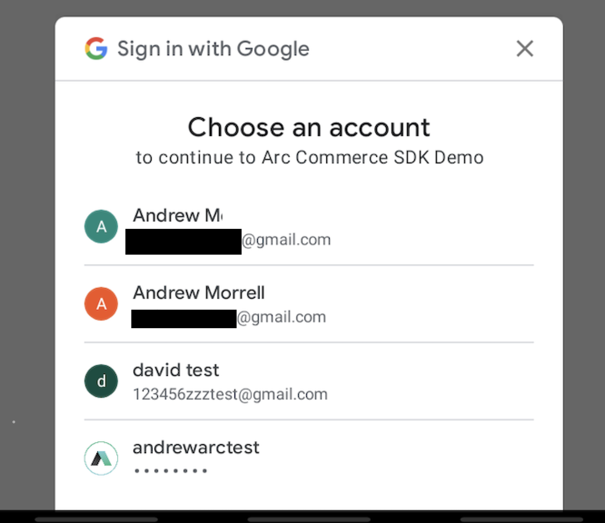
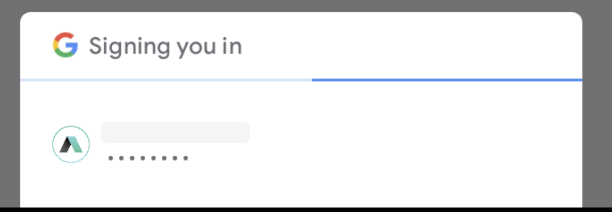

# Google One-Tap

The Google One-Tap login feature is available in version (commerce sdk 0.2.0 and later, all versions of single sdk)

To launch the One-Tap login process use the following method:

```kotlin
ArcXPMobileSDK.commerceManager().loginWithGoogleOneTap(activity, listener: ArcxpIdentityListener)
```

Two methods have been added to the ArcxpCommerceConfig class:

* `enableGoogleOneTap(enable: Boolean)` - Turns One-Tap on or off. Default is on (true). This is only needed if you wish to disable One-Tap
* `enableGoogleOneTapAutoLogin(enable: Boolean)` - Enable auto login after One-Tap returns the user credentials. Auto login will automatically log the user into ArcXP after authenticating the user credentials. If auto login is turned off the client code will be returned the username/password/token and can handle the login itself. Default is `true`.

## Logging in with One-Tap

The user must first have or create an ArcXP login. This can either be created using a username/password combination (Commerce Module registration process) or a Google token (Login through Google).

When One-Tap is activated by calling `loginWithGoogleOneTap()` the login flow will start.

1. If the user only has a single account on the device that is capable of logging into Arc then they will be presented with a screen confirming that they want to log in with that account. It looks like the one below.<br />
2. If the user has multiple accounts on the device capable of logging into Arc then they will be presented with a dialog asking them to select an account.<br />

Once the user has selected an account from this dialog the previous dialog will be shown if the user has never agreed to sharing their account information.

If the user has agreed to sharing information or if they have previously agreed to it with the same account they will be shown the login dialog.



This will be present during the login process and will automatically go away when complete. At that point one tap login will be complete and two different things will happen depending upon the `ArcxpCommerceConfig` settings.

If the user has set `enableGoogleOneTapAutoLogin(false)` then the client code will be returned the username/password/token information for the login. This can be gotten the following way:

```kotlin
ArcXPMobileSDK.commerceManager().loginWithGoogleOneTap(activity!!, object: ArcxpIdentityListener()) {
    override fun onGoogleOneTapLoginSuccess(username: String?, password: String?, token: String?) {
    //do something with the username/password or with the token
    }
}
```

The client code can then handle the login itself.

Additionally, if the developer has set `enableGoogleOneTapAutoLogin(false)` then the SDK will complete the login with the username/password or token. This is the same as calling `login(username, password, listener)` or `thridPartyLogin(token, GrantType.GOOGLE, listener)`.

## Error Handling

Errors are returned through the callback listener method `onLoginError()`. The format is the same as other ArcxpCommerceManager methods.

```kotlin
ArcXPMobileSDK.commerceManager().loginWithGoogleOneTap(activity!!, object: ArcxpIdentityListener() {
    override fun onLoginError(error: ArcxpError) {
    //respond to error
    }
}
```