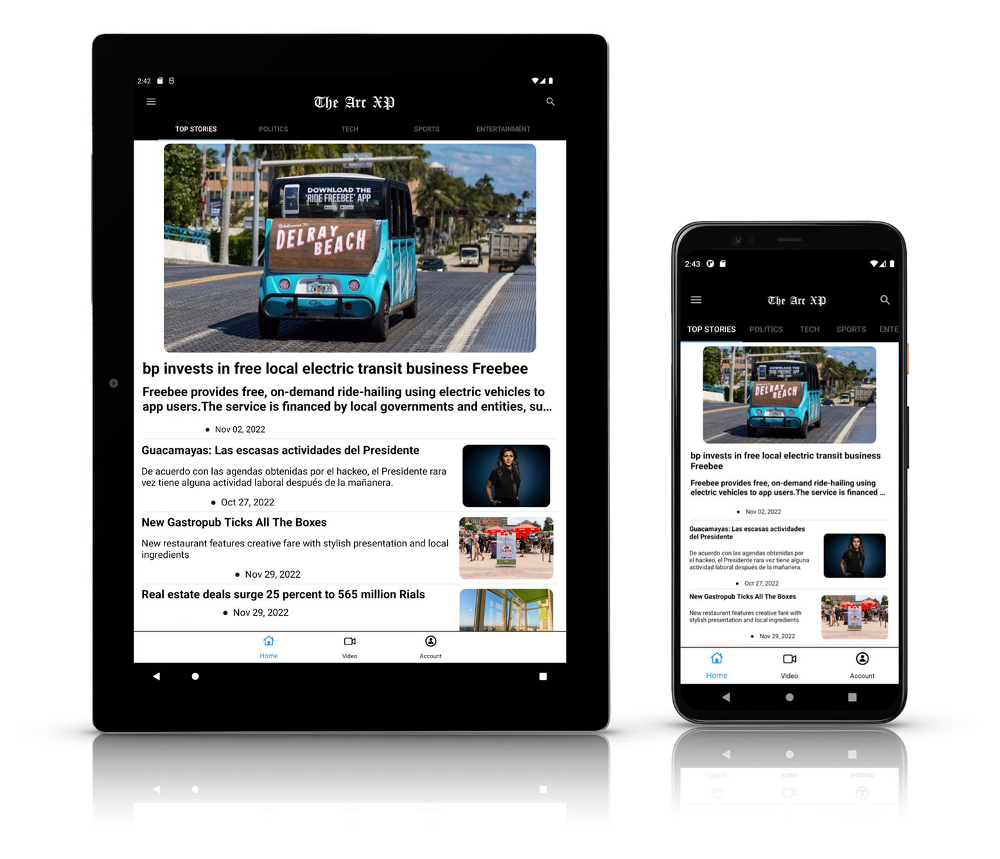
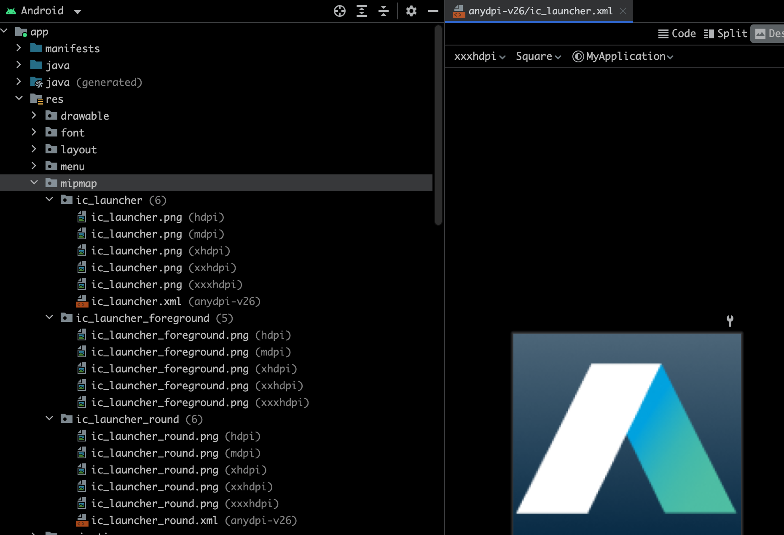
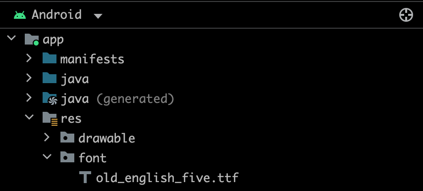
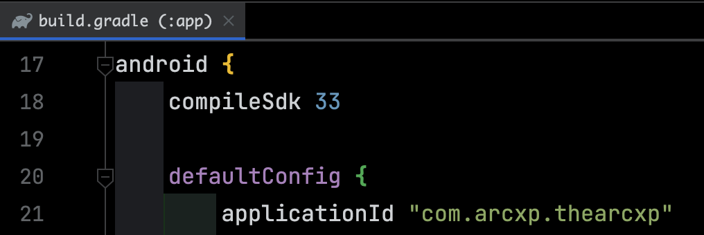

# The Arc XP Android

| | |
|---|---|
| The Arc XP Android sample app is a basic news reader app created using the Mobile SDK to connect and showcase various Arc XP services such as retrieving articles, login, and playing videos.  Clients can fork our sample repository and customize it for their particular usage, or simply reference it as an usage example for our SDK in their applications. | 

[Video Walkthrough](https://docs.arcxp.com/en/products/mobile/video--using-the-mobile-sdk-and-sample-news-app.html)

## Getting Access

the repository can be found here:

[https://github.com/arcxp/the-arcxp-android](https://github.com/arcxp/the-arcxp-android)


## SDK Setup

More in depth setup instructions for our SDK can be found at the following link:

[Mobile SDK Initialization](getting-started-initialization.md) follow the optional content configuration to get content, commerce and video set up

* Uses Outbound Feeds, Site Service, and WebSked to curate, organize and search site content  (optional for sdk, required for this app, follow content initialization below)
* Uses Video Center to access video content
* Provides login, paywall and related features (optional, follow commerce initialization below)

The configuration parameters needed for SDK initialization for the sample app are organized into _strings.xml_ resource file.  You will need to alter these per your **org**, **site**, **baseURL**, **site service**, and **video collection** name:

```
<resources>
    <string name="app_name">The Arc XP</string>

    <!-- client defined setup-->
    <string name="orgName">arcsales</string>
    <string name="environment">sandbox</string>
    <string name="siteName">site</string>
    <string name="commerceUrl">https://arcsales-arcsales-sandbox.api.cdn.arcpublishing.com</string>
    <string name="contentUrl">https://arcsales-arcsales-sandbox.web.arc-cdn.net</string>
    <string name="navigation_endpoint">mobile-nav</string>
    <string name="video_endpoint">mobile-video</string>

..
```

## Customization

### Content

Follow the [Content Module setup](getting-started-with-the-content-module.md) (Prerequisite Section) to organize your site categories with Site Service.  The name you give this will correspond to the `navigation_endpoint` in your _strings.xml_ resource.

And keep following the guide to create Collections using WebSked to match your Site Service categories.  Additional you can define your own `video_endpoint` in your _strings.xml_ for a video only list corresponding with a WebSked collection id.

### Strings

All the strings used for display are organized in _strings.xml_ resource file and can be translated by overriding for other locales.

Including: **App name**, **Terms of Service** URL, **Privacy Policy** URL

### App Icons

| | |
|---|---|
| App Icons for app thumbnail, play store builds: <br> Follow Google's guidelines for creating adaptive icons [here](https://developer.android.com/studio/write/image-asset-studio).<br> The resulting vectors and bitmaps can be placed in your android build mipmap resource directory as such:||

### Fonts / Styling

| | |
|---|---|
| Android includes a few fonts by default, but you can add any `.ttf` file to your project resources to add a custom font. Simply add to your resource folder as such:| |

Once a font has been added to the project, you can reference it in any style. 

You can set in Typography via compose for global changes:

```kotlin
val Typography = Typography(

    //style for top and app bar
    titleLarge = TextStyle(
        fontFamily = FontFamily(Font(R.font.old_english_five)),
        fontWeight = FontWeight.Bold,
    ),
...
```

In this sample App, we have some text styles in Typography for different text blocks such as title/body/label, and further customization is defined in the composable functions themselves.
In this manner you can directly add styling to file and see updates in preview.  
Properties such as padding and font sizes can be set dynamically in dimensional resources, but any app wide changes can be set on these styles.

### Colors

All the app colors are in _Color.kt_ file and the schemes are defined in `Theme.kt` file.

The main colors of app are primary/background which are merely swapped for night mode.  You can change any of the colors in `Color.kt` if desired as well.

More colors are available to override including error color, background, text color, edit text color, etc.

```kotlin
private val darkScheme = darkColorScheme(
    primary = white, //used for spinner, tab highlights currently
    onBackground = white,  //used for text
    background = black, //background color
    secondary = primaryAccent,//used for highlight color,
    tertiary = Color.Gray, //used for selections
    onTertiaryContainer = Color.LightGray, //used for selections inverse
    inverseSurface = black, //used for menu background color, is same in this example to keep menu colors consistent
    inverseOnSurface = white, //used for menu background text/icon colors, is same in this example to keep menu colors consistent
    error = error,  //used for error texts
)

private val lightScheme = lightColorScheme(
    primary = black, //used for spinner, tab highlights currently
    onBackground = black, //used for text
    background = white, //background color
    secondary = primaryAccent,//used for highlight color
    tertiary = Color.Gray, //used for selections
    onTertiaryContainer = Color.LightGray, //used for selections inverse
    inverseSurface = black, //used for menu background color, is same in this example to keep menu colors consistent
    inverseOnSurface = white, //used for menu background text/icon colors, is same in this example to keep menu colors consistent
    error = error, //used for error texts
```

## Google Ad Integration

Follow the instructions in the article [The Arc XP News App - Google AdMob Implementation](the-arc-xp-news-app-google-admob-implementation.md)

## Firebase/ Google Analytics Integration

Follow instructions in the article [Firebase Setup for News App - Analytics/Push notifications](firebase-setup-for-news-app-analyticspush-notifications.md)

## Google Play Store Submission

| | |
|---|---|
| Once you have fully customized the application with your credentials and getting data back as expected, you may want to submit to Play Store for further testing and finally release to public.<br>To distribute to the Play Store:<br>You need to customize the applicationId in your gradle: this value must be unique among play store apps (so can't be the current value). For more information, visit [Create and set up your app](https://support.google.com/googleplay/android-developer/answer/9859152?hl=en)<br>You will need custom icons, screen shot, signing key, and other things same as any other Play Store submission.| |
