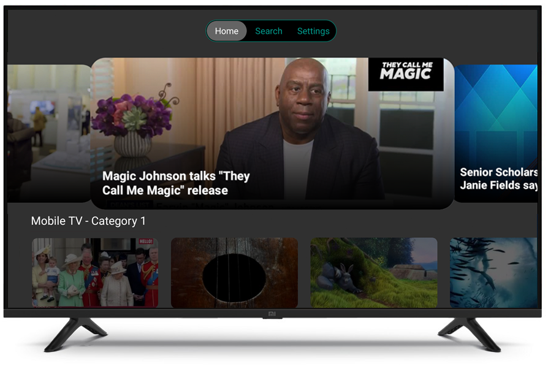
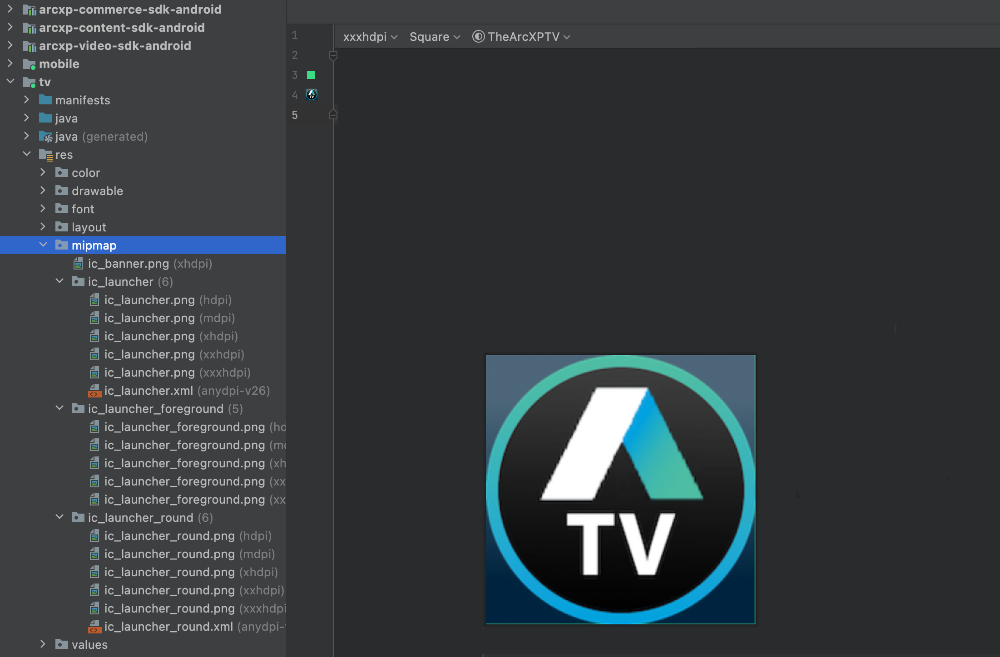
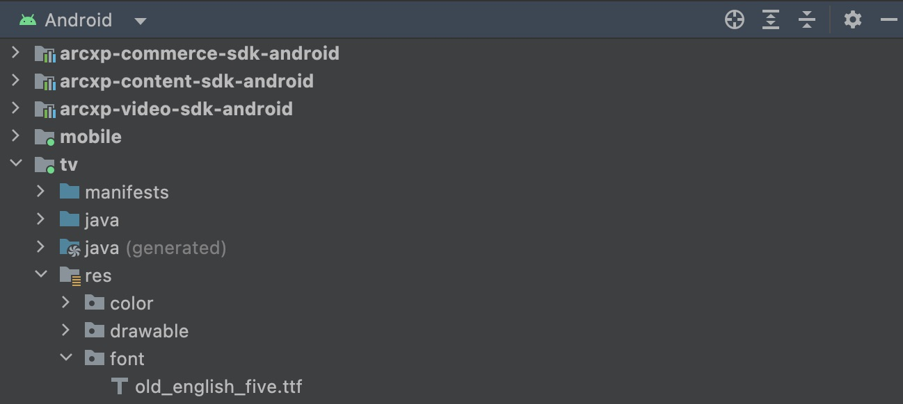
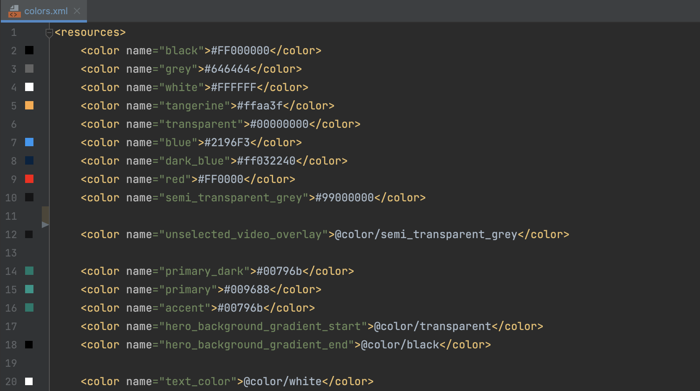
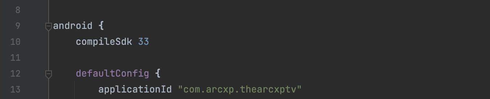

# The Arc XP TV sample app

The Arc XP TV sample app is a basic TV app created using the Content and Video modules of the Mobile SDK to connect and showcase various Arc XP services such as live videos, virtual channels, and curated VODs (video on demand). Clients can fork our sample repository and customize it for their particular usage, or simply reference it as an example for our Mobile SDK in their applications.


## Getting Access

the repository can be found here:

[https://github.com/arcxp/the-arcxp-tv-android](https://github.com/arcxp/the-arcxp-tv-android)


## SDK Setup

more in depth setup instructions for SDK can be found at the following link:

[Mobile SDK Initialization](getting-started-initialization.md) follow the optional content configuration to get content and video set up

- Uses Outbound Feeds, Site Service, and WebSked to curate, organize and search site content

- Uses Video Center to access video content

The configuration parameters needed for SDK initialization for the sample app are organized into `strings.xml` resource file.  You can alter these per your org, site, baseURL, site service, and video collection name:

```xml
<resources>
    <string name="app_name">The Arc XP TV</string>

    <!-- client defined setup-->
    <string name="orgName">arcsales</string>
    <string name="environment">sandbox</string>
    <string name="siteName">arcsales</string>
    <string name="commerceUrl">https://arcsales-arcsales-sandbox.api.cdn.arcpublishing.com</string>
    <string name="contentUrl">https://arcsales-arcsales-sandbox.web.arc-cdn.net</string>
    <string name="navigation_endpoint">mobile-tv</string>

    <string name="virtual_channel_uuid">62a89e9adadf760a8fadfaaf</string>
    <string name="virtual_channel_row_title">Virtual Channels</string>

..
```

## Virtual Channels

Currently, virtual channels require a hardcoded uuid in the strings file. This string will be used in the `findByUuid` method in the MainViewModel class to get the channel. Future updates may include getting virtual channels through an api request.

## Customization

### Content

Follow the [Content Module setup](getting-started-with-the-content-module.md) (Prerequisite Section) to organize your site categories with Site Service.  The name you give this will correspond to the `navigation_endpoint` in your `strings.xml` resource.

And keep following the guide to create Collections using WebSked to match your Site Service categories.  Additional you can define your own `video_endpoint` in your `strings.xml` for a video only list corresponding with a WebSked collection id.

### Strings

All the strings used for display are organized in `strings.xml` resource file and can be translated by overriding for other locales.

Including: **App name**, **Terms of Service** URL, **Privacy Policy** URL

### App Icons

| | |
|---|---|
| App Icons for app thumbnail, play store builds:<br>Follow [Google's guidelines for creating adaptive icons](https://developer.android.com/studio/write/image-asset-studio). <br> The resulting vectors and bitmaps can be placed in your android build mipmap resource directory as such:| |

### Fonts / Styling

| | |
|---|---|
| Android includes a few fonts by default, but you can add any `.ttf` file to your project resources to add a custom font. Simply add to your resource folder as such:| 

Once a font has been added to the project, you can reference it in any style:

```xml
<style name="Theme.TheArcXPTV" parent="Theme.AppCompat.Leanback">
        <item name="android:fontFamily">sans-serif</item>
...
```

or directly into a view xml if desired.

In this app, all text derives from 2 main styles, though some use inheritance along the way for further customization.

Altering the font in these 2 styles can effectively change the font app wide.  All styles are in `styles.xml` resource file.

| | |
|---|---|
|`Theme.TheArcXPTV`| Main text view style that most on screen text (including buttons) derives from |
| `TabStyle` | Style only for the tab bar layout |

### Colors

| | |
|---|---|
| All the app colors are in colors.xml resource file<br>The main colors of app are primary/primary Dark. You can change any of the colors in `colors.xml` to your liking.<br>More colors are available to override including error color, background, text color, etc.|  |

## Google Play Store Submission

| | |
|---|---|
| Once you have fully customized the application with your credentials and getting data back as expected, you may want to submit to Play Store for further testing and finally release to public.<br>To distribute to the Play Store:<br>You need to customize the applicationId in your gradle: this value must be unique among play store apps (so can't be the current value). For more information, visit [Create and set up your app](https://support.google.com/googleplay/android-developer/answer/9859152?hl=en).<br>You will need custom icons, screen shot, signing key, and other things same as any other Play Store submission.| |
